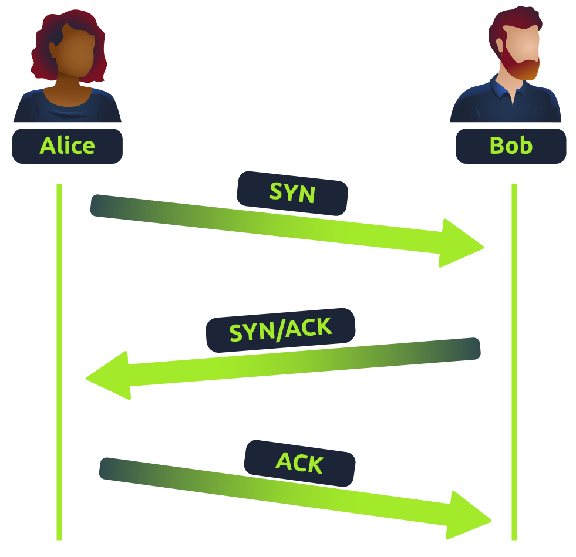

# Packets & Frames

Date: 01.03.2026

Room Category: Theory

Core Concept: Data encapsulation and transport protocols

Continuing the network theory grind! This room builds right on top of the OSI Model and LAN concepts we just went through. As someone aiming to be a SOC Analyst, I know I'll be staring at packet captures (PCAPs) constantly. Understanding the difference between a packet and a frame, and knowing how TCP and UDP work under the hood is absolutely essential for spotting malicious traffic. Plus, this is prime Security+ exam material.

***

## Task 1: What are Packets and Frames

In this task, we break down the difference between a packet and a frame. Tying this back to the OSI model we just covered: when data is sitting at Layer 3 (Network layer) and has IP routing information attached, it's called a packet. When that data drops down to Layer 2 (Data Link layer) to travel across our local network, it gets wrapped in a frame (which uses MAC addresses). It's essentially like putting a letter with a mailing address (packet) inside a local delivery envelope (frame).

Question: What is the name for a piece of data when it does have IP addressing information?

> Answer: Packet

Question: What is the name for a piece of data when it does not have IP addressing information?

> Answer: Frame

***

## Task 2: TCP/IP (The Three-Way Handshake)

TCP is the workhorse of the internet. It is a "connection-oriented" protocol, which means it guarantees that your data will actually reach its destination intact. It establishes this reliable connection using the famous Three-Way Handshake. It also includes a checksum in the header to verify that the data wasn't corrupted or tampered with in transit. From a SOC perspective, knowing what a normal handshake looks like is crucial so we can spot anomalies like SYN floods!

<figure><figcaption></figcaption></figure>

Question: What is the header in a TCP packet that ensures the integrity of data?

> Answer: Checksum

Question: Provide the order of a normal Three-way handshake (with each step separated by a comma)

> Answer: SYN, SYN/ACK, ACK

***

## Task 3: Practical Handshake

In this question we have to play a short conversation between Alice and Bob by choosing the right handshake action. Upon finishing the game, we're awarded with a flag.

Question: What is the value of the flag given at the end of the conversation?

> Answer: THM{TCP\_CHATTER}

***

## Task 4: UDP (User Datagram Protocol)

UDP is basically the wild west compared to TCP. It is "connectionless", meaning it just fires data at the target server and doesn't bother checking if it actually arrived. Because it completely skips the handshake and reliability checks, it is significantly faster. This makes it perfect for applications where speed is more critical than 100% accuracy, like video calls, streaming, or DNS requests.

<figure><figcaption></figcaption></figure>

Question: What does the term "UDP" stand for?

> Answer: User Datagram Protocol

Question: What type of connection is "UDP"?

> Answer: Stateless

Question: What protocol would you use to transfer a file?

> Answer: TCP

Question: What protocol would you use to have a video call?

> Answer: UDP

***

## Task 5: Ports 101 (Practical)

Knowing port numbers is absolutely vital. I need to have common ports like 21 (FTP), 22 (SSH), 80 (HTTP), and 443 (HTTPS) completely memorized for my Security+ exam this November. From a SOC perspective, monitoring what ports are being used is a huge part of the job. If I see RDP (3389) suddenly open to the internet, or a weird application running on a random port out of the 65,535 possible options, that's a massive red flag.&#x20;

The room uses a great harbor analogy: just like ships need to line up at compatible docks, network data has to connect to compatible ports to communicate properly.

Question: What is the flag received from the challenege?

> Answer: THM{YOU\_CONNECTED\_TO\_A\_PORT}

***

## Conclusion

That wraps up Packets & Frames! It’s really satisfying seeing the OSI Model theory actually map to real-world data structures like TCP handshakes and UDP traffic. I’m definitely going to need this knowledge when I start analyzing actual malware traffic or digging through logs. Moving on to the next one!

